## Definition

Heap is a tree-based data structure that satisfies the heap property.

Binary Heap is a binary tree with two properties:

- Shape Property: it must be a complete binary tree, which means the tree is
  fully filled except the deepest level, if the deepest level is not filled, the
  nodes of the that level are filled from left to right. Here is an example of a
  complete binary tree. **NOTE**: this property guarantees the tree has the
  smallest possible height.

  ```mermaid
  graph TD
  A --> B
  A --> C
  B --> D
  B --> E
  C --> F
  ```

<!--more-->

- Heap Property: if P is a parent node of C, then the key (the value) of P is
  either greater than or equal to (in a max heap) or less than or equal to (in a
  min heap) the key of C. Here is an example of max-heap.

**NOTE**: duplicate is allowed!

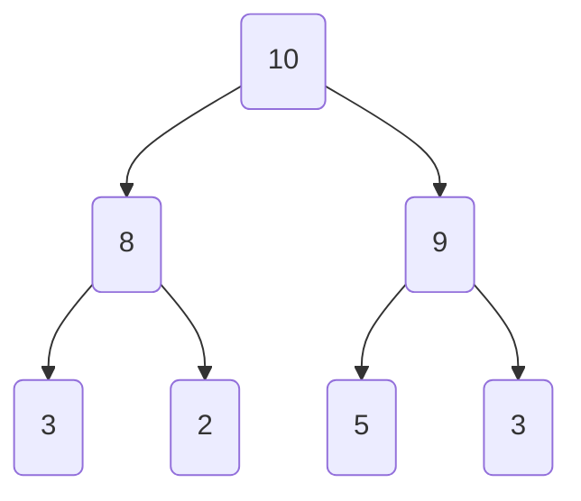

## Add and delete methods

### Add an element to the binary heap

Here is the current heap.

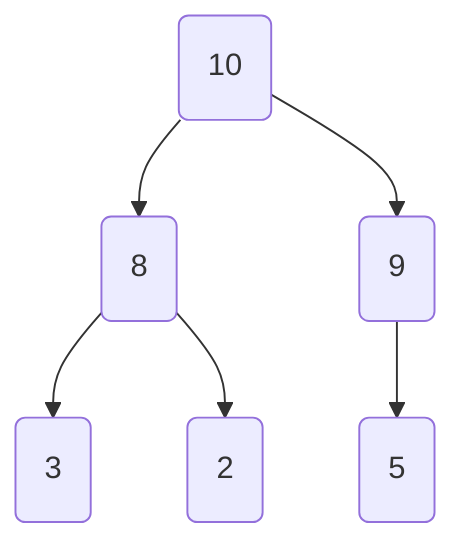

To add 11 to the heap, first add it to the empty node starting from left of the deepest level.

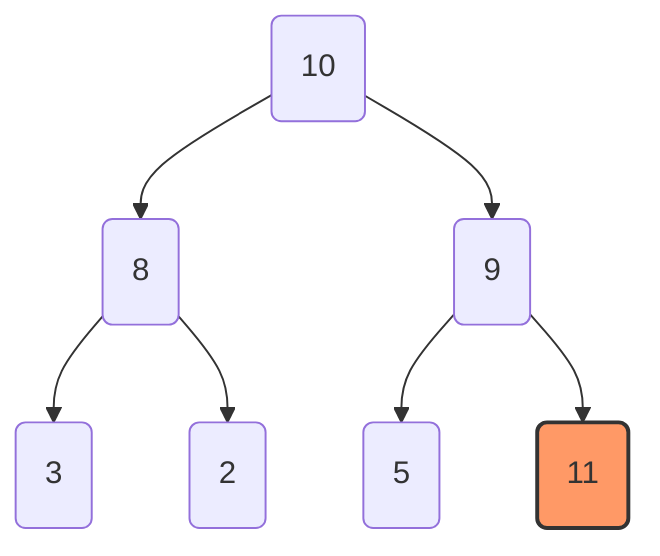

If the newly added node is larger than its parent, swap the node with its parent node.

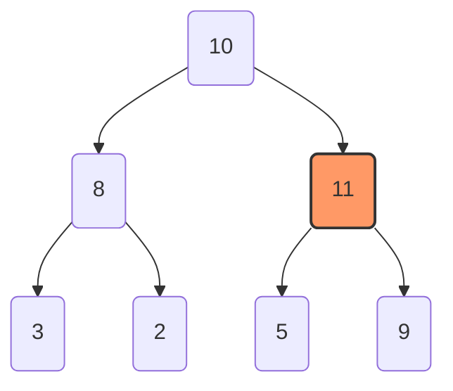

Until heap property is satisfied.

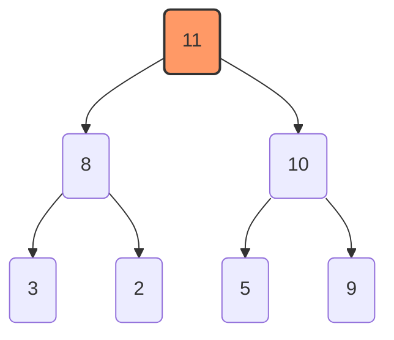

### Delete the root

The delete operation of heap usually means removing the root node (max/min value
of the heap). To delete the root node, first move the bottom right node to the
top in place of the original root node.

Original heap:

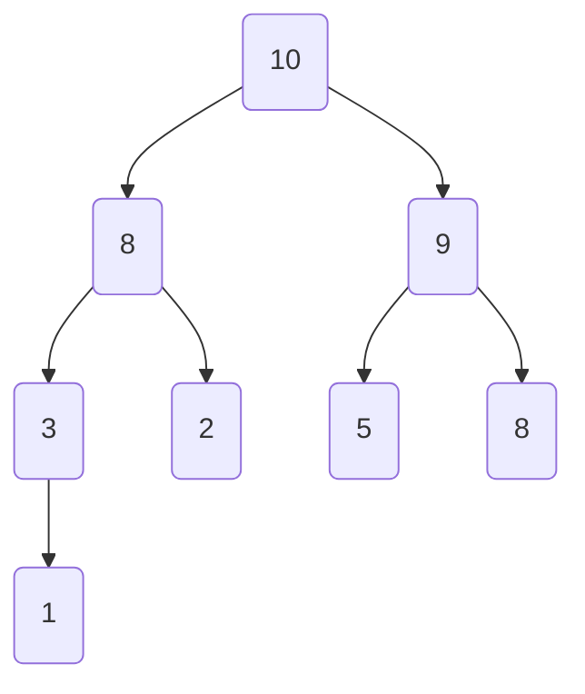

Move the bottom right node to the top.

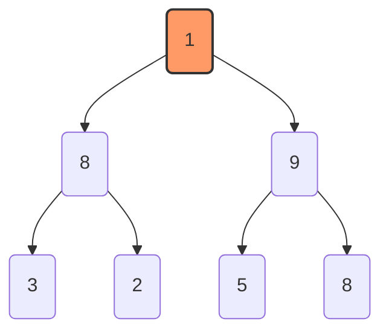

Now the shape property is satisfied, but the heap property is violated. Hence, second step is to retain the heap property, i.e. sink the root to the right place. The way to sink the "abnormal" node is to swap the "abnormal" node with its child node that has the larger (smaller for min-heap) value, which guarantees the heap property of the current level.


Keep sinking the "abnormal" node until it has no child nodes or the node is larger than all its child nodes.

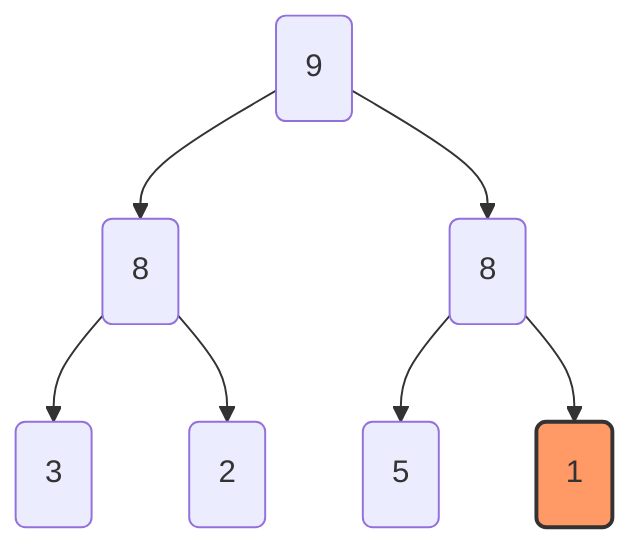

## Implementation of Binary Heap

Present the binary heap tree in an array from top to bottom and from left to right at each level.
Here is the tree representation.

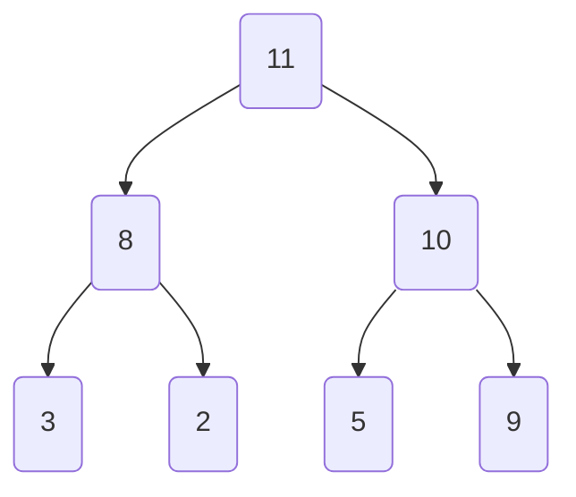

Here is the array representation.

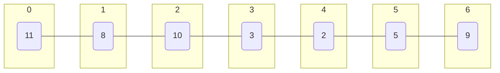

It is noted that the parent index and its child indices have the following relationship.

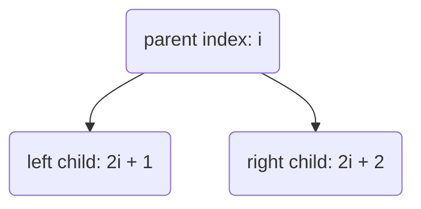

Now we have all the components to implement the binary heap. Here is the code.

```python
class BinaryHeap:
    def __init__(self):
        self.heap_list = []

    @property
    def size(self):
        return len(self.heap_list)

    def sift_down(self, i):
        left = 2 * i + 1
        right = 2 * i + 2

        largest = i
        if left < self.size and self.heap_list[left] > self.heap_list[largest]:
            largest = left

        if right < self.size and self.heap_list[right] > self.heap_list[largest]:
            largest = right

        if largest != i:
            self.heap_list[largest], self.heap_list[i] \
                = self.heap_list[i], self.heap_list[largest]
            self.sift_down(largest)

    def build_heap(self, array):
        # start building the heap from the bottom of the tree
        # this way can build the heap in time of O(n)

        self.heap_list = array
        i = (len(array) - 2) // 2
        while i >= 0:
            self.sift_down(i)
            i -= 1

    def deleteMax(self):
        last = self.heap_list.pop()
        self.heap_list[0] = last
        self.sift_down(0)

    def add(self, val):
        self.heap_list.append(val)
        self.sift_up(self.size - 1)

    def sift_up(self, i):
        p = self.get_parent_idx(i)
        if p >= 0 and self.heap_list[p] < self.heap_list[i]:
            self.heap_list[p], self.heap_list[i]\
                = self.heap_list[i], self.heap_list[p]
            self.sift_up(p)

    def get_parent_idx(self, idx):
        return (idx - 1) // 2

    def __str__(self):
        return str(self.heap_list)


if __name__ == '__main__':
    array = [3, 5, 9, 2, 11, 8, 10]
    print(array)

    h = BinaryHeap()
    h.build_heap(array)
    print(h)

    h.deleteMax()
    print(h)

    h.deleteMax()
    print(h)

    h.deleteMax()
    print(h)

    h.add(20)
    print(h)

    h.add(11)
    print(h)
```

Output:

```
[3, 5, 9, 2, 11, 8, 10]
[11, 5, 10, 2, 3, 8, 9]
[10, 5, 9, 2, 3, 8]
[9, 5, 8, 2, 3]
[8, 5, 3, 2]
[20, 8, 3, 2, 5]
[20, 8, 11, 2, 5, 3]
```
