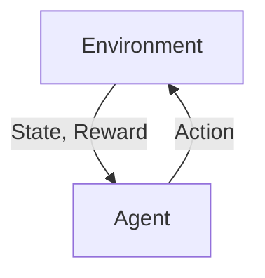
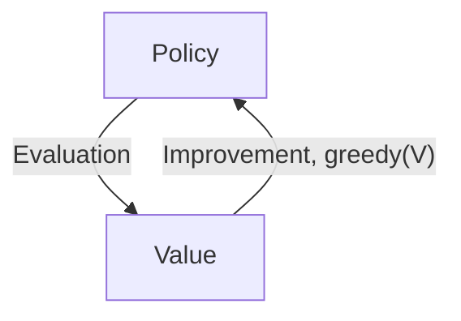

It has been ~4 years since I read through [Sutton's Reinforcement Learning textbook](http://incompleteideas.net/book/RLbook2020.pdf). It is time to review it especially in this post-ChatGPT eura, and see there are any "温故而知新" moments.

# $k$-arm Bandit Problem

Choose an action between $k$ options, and you will receive a numerical reward depending on your action, and the reward is sampled from a stationary probability distribution. You want to maximize your reward over certain time period.

- No state-action transition at all.

$\epsilon$-greedy: perform greedy actions (the action that gets the max immediate reward) most of the time, but select a random action with a probability of $\epsilon$.

# Markov Decision Process (MDP)

Define State $S_t$, Action $A_t$, Reward $R_t$, then a _trajectory_ is

$$S_0, A_0, R_1, S_1, A_1, R_2, S_2, A_2, ...$$

A model for this MDP could be a probability distribution of next state $s'$ and reward $r$, given current state $s$ and action $a$:

$$p(s', r|s, a)$$

# Bellman Equation

We want to maximize the total future reward at time $t$, and we call the total future reward as Return $G_t$.

$$G_t = R_{t+1} + R_{t+2} + ... $$

$G_t$ will go infinity. To make it converge, let's introduce a discount factor $0 < \gamma < 1$.

$$G_t = R_{t+1} + \gamma R_{t+2} + ...  = \sum_{k=0} \gamma^k R_{t+k+1} = R_{t+1} + \gamma G_{t+1}$$

The value function of a state $s$ under a policy $\pi$:

$$v_\pi(s) = E_\pi[G_t|S_t=s]$$

$$ = E_\pi[R_{t+1} + \gamma G\_{t+1}|S_t=s]$$

$$ = E_{s' \sim P, a \sim \pi}[r(s, a) + \gamma v_\pi(s')]$$

$$ = \sum_{a} \pi(a|s) \sum_{s', r} p(s', r|s, a) [r + \gamma v_\pi(s')]$$

The above is called Bellman Equation.

Consider $q_\pi(s, a)$ as the expected return if the agent take action $a$ at state $s$, then follow policy $\pi$ in the future steps.

We can also come up with Bellman Equation for $q_\pi(s, a)$.

$$q_\pi(s, a) = E_\pi [G_t | S_t = s, A_t = a]$$

$$ = E_{s' \sim P}[r(s, a) + \gamma E_{a \sim \pi}[q_\pi(s', a)]]$$

$$ = \sum_{s', r} p(s', r | s, a) [r + \gamma v_\pi(s')]$$

$$ = \sum_{s', r} p(s', r | s, a) [r + \gamma \sum_{a} \pi(a | s') q_\pi(s', a)]$$

Optimal value function and Q function:

$$
\begin{aligned}
v^*(s) & = \max_\pi v_\pi(s) \\
& = \max_a q_{\pi^*}(s, a) \\
& = \max_a \sum_{s', r} p(s', r|s, a)[r + \gamma v^*(s')]
\end{aligned}
$$

$$q^*(s, a) = \max_\pi q_\pi(s, a)$$

$$ = E[R_{t+1} + \gamma v^*(S_{t+1}) | S_t = s, A_t = a]$$

$$ = E_{s' \sim P} [r(s, a) + \gamma \max_{a'} q^*(s', a')]$$

# Dynamic Programming

DP refers to a collection of algorithms that can be used to compute optimal policies given a **perfect** model of the environment.

## Policy Evaluation (Prediction)

Evaluate the state-value function $v_\pi$ for a given policy $\pi$. How good the policy $\pi$ is at each state.

$$
\begin{aligned}
v_\pi(s) & = E_\pi[R_{t+1} + \gamma v_\pi(S_{t+1}) | S_t=s] \\
& = \sum_a \pi(a | s) \sum_{s', r}p(s', r | s, a) [r + \gamma v_\pi(s')]
\end{aligned}
$$

Note that $\pi(a\|s)$ and $p(s', r \| s, a)$ is known. 

We can start with a random guess of $v$, and keep updating $v$ with its current value using Bellman Equation.

$$v_{k + 1} = \sum_a \pi(a | s) \sum_{s', r}p(s', r | s, a) [r + \gamma v_k(s')]$$

$v_k$ can be proved to converge $v_\pi$ according to fixed point theorem.

Then we can use a iterative policy evalution process to estimate $v$ by doing a _sweep_ of all the states:

> For all the $s$ in the state space, 

> start with a random guess of $v(s)$, 

> keep updating $v$ using the above equation until it converges.

## Policy Improvement

$$q_\pi(s, a) = \sum_{s', r} p(s', r | s, a) [r + \gamma v_\pi(s')]$$

Consider a new policy $\pi'$ that selects $a$ such that $q_\pi(s, \pi'(s)) \ge v_\pi(s)$, then we can prove $v_{\pi'} \ge q_\pi(s, \pi'(s)) \ge v_\pi(s)$.

Hence $\pi'$ is not a worse policy than $\pi$. 

It is a straightforward choice to go greedy, and we are guaranteed to get a new policy that is not worse than the previous one.

$$
\begin{aligned}
\pi'(s) & = \arg \max_a q_\pi(s, a) \\
& = \arg \max_a \sum_{s', r} p(s', r | s, a) [r + \gamma v_\pi(s')]
\end{aligned}
$$

If $\pi'$ stops improving, $v_{\pi'}(s) = v_\pi(s)$, then 

$$\pi'(s) = \arg \max_a \sum_{s', r} p(s', r | s, a) [r + \gamma v_{\pi'}(s')]$$

Then Bellman optimality is achieved, $\pi'(s) = \pi^*(s)$

## Policy Iteration
Starting with a random policy $\pi_0$, evaluate its value $v_{\pi_0}$, then improve the policy to $\pi_1$ by greedy update, then evaluate it again, until the policy does not improve any more.

$$\pi_0 \rightarrow v_{\pi_0} \rightarrow \pi_1 \rightarrow v_{\pi_1} \rightarrow ... \rightarrow \pi^* \rightarrow v^*$$

## Value Iteration
In fact, we don't need to do multiple sweeps in the policy evaluation, and we are still guaranteed to converge to $v^*$ by just doing one sweep, this is called _value_ _iteration_.

By combining the evaluation and improvement steps, we get 

$$v_{k+1}(s) = \max_a \sum_{s', r} p(s', r|s, a) [r + \gamma v_k(s')]$$

Note that this update equation is the same as the Bellman optimality equation for the value function.

## Async DP
Doing a sweep for all the states could be computationally intractable. Some game could have $10^{20}$ states.

We don't need to update the value of all the states at each step. For example, we could just update one state, $s_k$, on each step $k$, using the value iteration equation above. We are able to converge to $v^*$ if **all states** occur in the sequence ${s_k}$ infinite many times.

We can select the states to which we apply updates. **This is an interesting research area.**

We can run iterative DP at the same time that an agent is acutally experiencing the MDP.

## Generalized Policy Iteration (GPI)

Let policy-evaluation and policy-improvement process interact. Almost all reinforcement learning methods are well described as GPI.

In fact, these 2 processes are competing and cooperating with each other. Greedy policy improvements with make the value estimation less accurate. Better value estimation makes the policy less greedy. Finally they reach a single joint solution, optimal value function and optimal policy.

# Monte Carlo Methods

Now we do not assume we have the complete knowledge of the environment, but we can learn from the experience, i.e. sample sequences of states, actions and rewards from actual or simulated interactions with an environment.

## MC Prediction

Predict the value function of a policy $\pi$: 
- Generate A LOT of sequences 
- Find the first visit (or every-visit) of state $s$, then compute and save the Return. 
- Compute the average return of $s$.

## MC estimation of action-value function

We are actually more interested in computing $q_\pi(s, a)$, since the model is unknown to us, knowing $v^*$ is not sufficient for us to get the policy.

The poblem is many state-action pairs may never be visited. How do we **maintain exploration**?
- One way to do so, is by specifying the episodes start in a state-action pair, and that every pair has a nonzero probability of being selected as the start. We call this assumption as **exploring starts**.

## On-Policy v.s. Off-Policy
On-Policy: evaluate or improve the policy that will be used to make optimal decisions. But we do $\epsilon$-greedy for exploration.

Off-Policy: the policy we evaluate and improve is different from the one that generates the data. The policy being learned is _target_ _policy $\pi$,and the policy used to generate behavior is _behavior_ _policy_ $b$. Learn from data generated by a conventional non-learning controller or a human expert.

We require that every action taken under $\pi$ is also taken, at least occasionally, under $b$. This is called the assumption of **coverage**.

### Importance Sampling