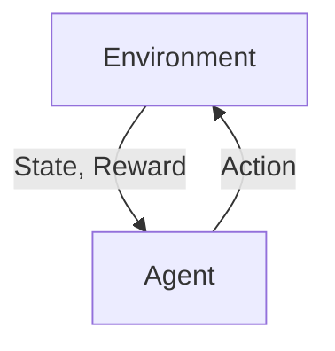
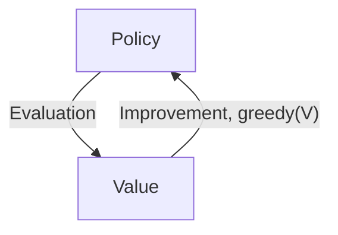

It has been ~4 years since I read through [Sutton's Reinforcement Learning textbook](http://incompleteideas.net/book/RLbook2020.pdf). It is time to review it especially in this post-ChatGPT eura, and see there are any "温故而知新" moments.

# $k$-arm Bandit Problem

Choose an action between $k$ options, and you will receive a numerical reward depending on your action, and the reward is sampled from a stationary probability distribution. You want to maximize your reward over certain time period.

- No state-action transition at all.

$\epsilon$-greedy: perform greedy actions (the action that gets the max immediate reward) most of the time, but select a random action with a probability of $\epsilon$.

# Markov Decision Process (MDP)



Define State $S_t$, Action $A_t$, Reward $R_t$, then a _trajectory_ is

$$S_0, A_0, R_1, S_1, A_1, R_2, S_2, A_2, ...$$

A model for this MDP could be a probability distribution of next state $s'$ and reward $r$, given current state $s$ and action $a$:

$$p(s', r|s, a)$$

# Bellman Equation

We want to maximize the total future reward at time $t$, and we call the total future reward as Return $G_t$.

$$G_t = R_{t+1} + R_{t+2} + ... $$

$G_t$ will go infinity. To make it converge, let's introduce a discount factor $0 < \gamma < 1$.

$$G_t = R_{t+1} + \gamma R_{t+2} + ...  = \sum_{k=0} \gamma^k R_{t+k+1} = R_{t+1} + \gamma G_{t+1}$$

The value function of a state $s$ under a policy $\pi$:

$$v_\pi(s) = E_\pi[G_t|S_t=s]$$

$$ = E_\pi[R_{t+1} + \gamma G\_{t+1}|S_t=s]$$

$$ = E_{s' \sim P, a \sim \pi}[r(s, a) + \gamma v_\pi(s')]$$

$$ = \sum_{a} \pi(a|s) \sum_{s', r} p(s', r|s, a) [r + \gamma v_\pi(s')]$$

The above is called Bellman Equation.

Consider $q_\pi(s, a)$ as the expected return if the agent take action $a$ at state $s$, then follow policy $\pi$ in the future steps.

We can also come up with Bellman Equation for $q_\pi(s, a)$.

$$q_\pi(s, a) = E_\pi [G_t | S_t = s, A_t = a]$$

$$ = E_{s' \sim P}[r(s, a) + \gamma E_{a \sim \pi}[q_\pi(s', a)]]$$

$$ = \sum_{s', r} p(s', r | s, a) [r + \gamma v_\pi(s')]$$

$$ = \sum_{s', r} p(s', r | s, a) [r + \gamma \sum_{a} \pi(a | s') q_\pi(s', a)]$$

Optimal value function and Q function:

$$
\begin{aligned}
v^*(s) & = \max_\pi v_\pi(s) \\
& = \max_a q_{\pi^*}(s, a) \\
& = \max_a \sum_{s', r} p(s', r|s, a)[r + \gamma v^*(s')]
\end{aligned}
$$

$$q^*(s, a) = \max_\pi q_\pi(s, a)$$

$$ = E[R_{t+1} + \gamma v^*(S_{t+1}) | S_t = s, A_t = a]$$

$$ = E_{s' \sim P} [r(s, a) + \gamma \max_{a'} q^*(s', a')]$$

# Dynamic Programming

DP refers to a collection of algorithms that can be used to compute optimal policies given a **perfect** model of the environment.

## Policy Evaluation (Prediction)

Evaluate the state-value function $v_\pi$ for a given policy $\pi$. How good the policy $\pi$ is at each state.

$$
\begin{aligned}
v_\pi(s) & = E_\pi[R_{t+1} + \gamma v_\pi(S_{t+1}) | S_t=s] \\
& = \sum_a \pi(a | s) \sum_{s', r}p(s', r | s, a) [r + \gamma v_\pi(s')]
\end{aligned}
$$

Note that $\pi(a\|s)$ and $p(s', r \| s, a)$ is known. 

We can start with a random guess of $v$, and keep updating $v$ with its current value using Bellman Equation.

$$v_{k + 1} = \sum_a \pi(a | s) \sum_{s', r}p(s', r | s, a) [r + \gamma v_k(s')]$$

$v_k$ can be proved to converge $v_\pi$ according to fixed point theorem.

Then we can use a iterative policy evalution process to estimate $v$ by doing a _sweep_ of all the states:

> For all the $s$ in the state space, 

> start with a random guess of $v(s)$, 

> keep updating $v$ using the above equation until it converges.

## Policy Improvement

$$q_\pi(s, a) = \sum_{s', r} p(s', r | s, a) [r + \gamma v_\pi(s')]$$

Consider a new policy $\pi'$ that selects $a$ such that $q_\pi(s, \pi'(s)) \ge v_\pi(s)$, then we can prove $v_{\pi'} \ge q_\pi(s, \pi'(s)) \ge v_\pi(s)$.

Hence $\pi'$ is not a worse policy than $\pi$. 

It is a straightforward choice to go greedy, and we are guaranteed to get a new policy that is not worse than the previous one.

$$
\begin{aligned}
\pi'(s) & = \arg \max_a q_\pi(s, a) \\
& = \arg \max_a \sum_{s', r} p(s', r | s, a) [r + \gamma v_\pi(s')]
\end{aligned}
$$

If $\pi'$ stops improving, $v_{\pi'}(s) = v_\pi(s)$, then 

$$\pi'(s) = \arg \max_a \sum_{s', r} p(s', r | s, a) [r + \gamma v_{\pi'}(s')]$$

Then Bellman optimality is achieved, $\pi'(s) = \pi^*(s)$

## Policy Iteration
Starting with a random policy $\pi_0$, evaluate its value $v_{\pi_0}$, then improve the policy to $\pi_1$ by greedy update, then evaluate it again, until the policy does not improve any more.

$$\pi_0 \rightarrow v_{\pi_0} \rightarrow \pi_1 \rightarrow v_{\pi_1} \rightarrow ... \rightarrow \pi^* \rightarrow v^*$$

## Value Iteration
In fact, we don't need to do multiple sweeps in the policy evaluation, and we are still guaranteed to converge to $v^*$ by just doing one sweep, this is called _value_ _iteration_.

By combining the evaluation and improvement steps, we get 

$$v_{k+1}(s) = \max_a \sum_{s', r} p(s', r|s, a) [r + \gamma v_k(s')]$$

Note that this update equation is the same as the Bellman optimality equation for the value function.

## Async DP
Doing a sweep for all the states could be computationally intractable. Some game could have $10^{20}$ states.

We don't need to update the value of all the states at each step. For example, we could just update one state, $s_k$, on each step $k$, using the value iteration equation above. We are able to converge to $v^*$ if **all states** occur in the sequence ${s_k}$ infinite many times.

We can select the states to which we apply updates. **This is an interesting research area.**

We can run iterative DP at the same time that an agent is acutally experiencing the MDP.

## Generalized Policy Iteration (GPI)


Let policy-evaluation and policy-improvement process interact. Almost all reinforcement learning methods are well described as GPI.

In fact, these 2 processes are competing and cooperating with each other. Greedy policy improvements with make the value estimation less accurate. Better value estimation makes the policy less greedy. Finally they reach a single joint solution, optimal value function and optimal policy.

# Monte Carlo Methods

Now we do not assume we have the complete knowledge of the environment, but we can learn from the experience, i.e. sample sequences of states, actions and rewards from actual or simulated interactions with an environment.

## MC Prediction

Predict the value function of a policy $\pi$: 
- Generate A LOT of sequences 
- Find the first visit (or every-visit) of state $s$, then compute and save the Return. 
- Compute the average return of $s$.

## MC estimation of action-value function

We are actually more interested in computing $q_\pi(s, a)$, since the model is unknown to us, knowing $v^*$ is not sufficient for us to get the policy.

The poblem is many state-action pairs may never be visited. How do we **maintain exploration**?
- One way to do so, is by specifying the episodes start in a state-action pair, and that every pair has a nonzero probability of being selected as the start. We call this assumption as **exploring starts**.

## On-Policy v.s. Off-Policy
- **On-Policy**: evaluate or improve the policy that will be used to make optimal decisions. But we do $\epsilon$-greedy for exploration.

- **Off-Policy*: the policy we evaluate and improve is different from the one that generates the data. The policy being learned is _target_ _policy $\pi$,and the policy used to generate behavior is _behavior_ _policy_ $b$. Learn from data generated by a conventional non-learning controller or a human expert.


### Importance Sampling

In the Off-Policy methods, how to estimate $v_\pi$ or $q_\pi$ with the episodes generated by another policy $b$.

**Assumption**: we require that every action taken under $\pi$ is also taken, at least occasionally, under $b$. This is called the assumption of **coverage**.

Almost all off-policy methods utilize **importance sampling**, a general technique for estimating expected values under one distribution given samples from another. The idea is asigning weights for each of the Return sampled from behavior policy (weighted average). The weight is the relative probablity of the trajectory occurring under the target policy and the behavior policy, so-called **importance-sampling ratio**.

$$Pr(A_t, S_{t+1}, A_{t+1}, ..., S_T|S_t, A_{t:T-1} \sim \pi) = \prod_{k=t}^{T-1} \pi(A_k | S_{k}) p(S_{k+1} | s=S_k, a=A_k)$$

Then the importance-sampling ratio is 

$$\rho_{t:T-1} = \frac{\prod_{k=t}^{T-1} \pi(A_k | S_{k}) p(S_{k+1} | s=S_k, a=A_k)}{\prod_{k=t}^{T-1} b(A_k | S_{k}) p(S_{k+1} | s=S_k, a=A_k)} = \prod_{k=1}^{T-1} \frac{\pi(A_k|S_k)}{b(A_k|S_k)}$$

Then 

$$v_b(s) = E[G_t|S_t=s]$$

$$v_\pi(s) = E[\rho_{t:T-1} G_t|S_t=s]$$

Now we can estimate $v_\pi(s)$ by sampling N trajectories under policy $b$, then compute some weighted average.

We can use either an ordinary importance sampling:

$$V(s) = \frac{\sum_{t \in T(s)} \rho_{t: T-1} G_t}{|T(s)|}$$

or a weighted importance sampling:

$$V(s) = \frac{\sum_{t \in T(s)} \rho_{t: T-1} G_t}{\sum_{t \in T(s)} \rho_{t: T-1}}$$

# Temporal-Difference Learning

Recall that in Monte Carlo methods, we wait until the finish of the episode to get the return $G_t$. Then we update the prediction of the value at state $s$ by 

$$V(S_t) \leftarrow V(S_t) + \alpha [G_t - V(S_t)]$$

Instead of waiting till episode finishes, we can do the value function update at the next time step using the newly observed Reward $R_{t+1}$: 


$$V(S_t) \leftarrow V(S_t) + \alpha [R_{t+1} + \gamma V(S_{t+1}) - V(S_t)]$$

This is called $TD(0)$, or one-step TD, since it is a special case of $n$-step TD, or $TD(\lambda)$.

TD is a **bootstrapping** method because it uses its own estimate at $t+1$ of $V(S_{t+1})$.

TD combines the ideas of both MC and DP: MC samples the trajectory to understand the dynamics, while DP bootstraps to predict the value at the next state.

**TD Error**: 

$$\delta_t = R_{t+1} + \gamma V(S_{t+1}) - V(S_t)$$

Then the MC error:

$$G_t - V(S_t) = \sum_{k=t}^{T-1}\gamma^{k-t} \delta_k$$

The above is not accurate if $V$ is updated during the episode, **but** it is close enough if the **step size is small enough**. **This reminds me of DDPG paper where they want to keep the update of target network to be small when doing the update.**

## Sarsa: On-Policy TD Control

We do $\epsilon$-greedy to guarantee the exploration. The key in this algorithm is we also use the value of the next state for estimation **even if the state is generated by the $\epsilon$ non-greedy action**, i.e. $Q(S', A')$.

$$Q(S, A) \leftarrow Q(S, A) + \alpha [R + \gamma Q(S', A') - Q(S, A)]$$

## Q-learning: Off-policy TD Control

Even though using $\epsilon$-greedy policy for exploration (behavior policy), we always estimate the value of the target policy which is always greedy. Then the value function update becomes

$$Q(S, A) \leftarrow Q(S, A) + \alpha [R + \gamma \max_a Q(S', a) - Q(S, A)]$$

The cliff walking problem is interesting, that Q-learning will learn the optimal path that is right next to the cliff, but Sarsa will learn a safer path due to estimating the value of $\epsilon$-greedy policy, which could go side way occasionlly. Q-learning learns the optimal policy but is not that practical in real world.


# Policy Gradient Algorithms

Reference: [OpenAI Spinning Up](https://spinningup.openai.com/en/latest/spinningup/rl_intro3.html).

## RL problem setup

Find an action policy that maximizes expected return.

The probability of a $T$-step trajectory when following a policy $\pi$:

$$P(\tau|\pi) = \rho_0(s_0) \prod_{t=0}^{T-1} p(s_{t+1}|s_t, a_t) \pi(a_t|s_t)$$

Then the expected return is 

$$J(\pi) = \int_\tau P(\tau|\pi) G(\tau) = E_{\tau \sim \pi}[G(\tau)]$$

Then we want to find the optimal $\pi$,

$$\pi^* = \arg \max_{\pi} J(\pi)$$


## Advantage Function

$$A^\pi(s, a) = Q^\pi(s, a) - V^\pi(s)$$

## Policy Gradient

Parameterize policy with parameter $\theta$. 

Then the policy gradient is 

$$
\begin{aligned}
\nabla_\theta J(\pi_\theta) & = \nabla_\theta E_{\tau \sim \pi_\theta}[G(\tau)] \\
& = \nabla_\theta \int_\tau P(\tau|\theta) G(\tau) \\
& = \int_\tau \nabla_\theta P(\tau|\theta) G(\tau) \\
& = \int_\tau P(\tau|\theta) \nabla_\theta \log P(\tau|\theta) G(\tau) \\
& = E_{\tau \sim \pi_\theta}[\nabla_\theta \log P(\tau|\theta) G(\tau)]
\end{aligned}
$$

In the above derivation, we get this from chain rule (note the gradient of $\log x$ is $1/x$):

$$\nabla_\theta \log P(\tau|\theta) = \frac{1}{P(\tau | \theta)} \nabla_\theta P(\tau|\theta)$$

The probability of a trajectory:

$$P(\tau|\theta) = \rho_0(s_0) \prod_{t=0}^{T-1} p(s_{t+1}|s_t, a_t) \pi_\theta(a_t|s_t)$$

Then the log of it becomes

$$\log P(\tau|\theta) = \log \rho_0(s_0) + \sum_{t=0}^T(\log P(s_{t+1}|s_t, a_t) + \log \pi_\theta(a_t|s_t))$$

Then get the gradient of $\theta$,

$$\nabla_\theta \log P(\tau|\theta) = \sum_{t=0}^T(\nabla_\theta \log \pi_\theta(a_t|s_t))$$

Finally, the policy gradient is 

$$\nabla_\theta J(\pi_\theta) = E_{\tau \sim \pi_\theta}[\sum_{t=0}^T(\nabla_\theta \log \pi_\theta(a_t|s_t)) G(\tau)]$$

If we have a set of trajectories, the estimate of the policy gradient can be computed as 

$$\hat{g} = \frac{1}{|D|} \sum_{\tau \in D} \sum_{t=0}^T \nabla_\theta \log \pi_\theta(a_t | s_t) G(\tau) $$

## Implementation of the simplest Policy Gradient Algorithm (REINFORCE)

```python
logits_net = mlp([obs_dim] + hidden_sizes + [n_actions])

def get_action_distribution(obs):
    logits = logits_net(obs)
    # This is a probablity distribution
    return Categorical(logits=logits)

def get_action(obs):
    return get_action_distribution(obs).sample().item()

def compute_loss(obs, act, returns):
    """Compute the surrogate loss

    This loss is not the actual loss we want to minimize, but the gradient
    of this loss equals the gradient of the policy, hence we want to use
    this to compute the policy gradient by leveraging the autodiff feature
    of PyTorch. So the value of this loss is meaningless, we only care about the gradient.
    """
    # Compute the log probabilities of the actions
    logp = self.get_action_distribution(obs).log_prob(act)
    # Negative because we want to maximize the expected return
    return -(logp * returns).mean()

def train_epoch():
    # Assuming T is the terminal time step.
    # s_t, t = 0, .. T - 1, but with multiple episodes concatenated
    batch_obs = []
    # a_t, t = 0, .. T - 1, but with multiple episodes concatenated
    batch_act = []
    # r_{t+1}, t = 0, .. T - 1, but with multiple episodes concatenated
    batch_rew = []

    # We want to sample multiple episodes to compute the MC estimate of the return
    curr_eps = 0
    eps_lens = []
    eps_returns = []
    while curr_eps < num_eps_per_epoch:
        curr_return = 0
        curr_step = 0
        obs, _ = env.reset()
        while True:
            act = policy(torch.as_tensor(obs, dtype=torch.float32)).to(device)
            next_obs, rew, truncated, terminated, _ = env.step(act)
            batch_obs.append(obs)
            batch_act.append(act)
            curr_return += rew
            obs = next_obs
            if truncated or terminated:
                batch_rew += [curr_return] * (curr_step + 1)
                break
            curr_step += 1
        eps_lens.append(curr_step)
        eps_returns.append(curr_return)
        curr_eps += 1

    loss = policy.compute_loss(
        torch.as_tensor(batch_obs, dtype=torch.float32).to(device),
        torch.as_tensor(batch_act, dtype=torch.int32).to(device),
        torch.as_tensor(batch_rew, dtype=torch.float32).to(device),
    )
    optimizer.zero_grad()
    loss.backward()
    optimizer.step()
    return eps_returns, eps_lens, loss
```

Notes:
- `compute_loss` use observations, actions, returns with multiple episodes concated together, returns is identical within the same episode. We want to compute the average across episodes and steps.
- The loss function is just a surrogate to compute the gradient. Its gradient is the same as the policy gradient, so we use it.

Here is the difference of number of trajectories used for policy gradient estimate. 
- Larger number of trajectory samples gives you better estimate of gradient, hence faster convergence, however, the step size seems to be too large when it reaches the limit.


## Revise the Return to Return-to-Go

Recall the policy gradient formula:

$$\nabla_\theta J(\pi_\theta) = E_{\tau \sim \pi_\theta} [\sum_{t=0}^T \nabla_\theta \log \pi_\theta(a_t|s_t) R(\tau)]$$

In fact, $\nabla_\theta \log \pi_\theta(a_t\|s_t)$ at time $t$ is independent of the rewards before $t$. Hence 

$$E_{\pi_\theta}[\nabla_\theta \log \pi_\theta(a_t|s_t) \sum_{i=0}^{t-1} r_i] = E_{\pi_\theta}[\nabla_\theta \log \pi_\theta(a_t|s_t)]E_{\pi_\theta}[\sum_{i=0}^{t-1} r_i]$$

Based on the **Expected Grad-Log-Prob(EGLP) lemma** (proved by the log trick mentioned above), 

$$E_{x \sim P_\theta(x)}[\nabla_\theta \log P_\theta(x)] = 0$$


$$E_{\pi_\theta}[\nabla_\theta \log \pi_\theta(a_t|s_t) \sum_{i=0}^{t-1} r_i] = E_{\pi_\theta}[\nabla_\theta \log \pi_\theta(a_t|s_t)]E_{\pi_\theta}[\sum_{i=0}^{t-1} r_i] = 0 \times E_{\pi_\theta}[\sum_{i=0}^{t-1} r_i] = 0$$

Use Return-to-go reduces the variance of the policy gradient estimate (we remove the independent part, hence less noisy), hence achieves quicker convergence.

Here is the return curves with and without using Return-to-Go. Training converges much faster.


## Introduce baseline

According to the EGLP lemma, 

$$E_{a_t \sim \pi_\theta}[\nabla_\theta \log \pi_\theta(a_t\|s_t) b(s_t)] = 0$$.

So the policy gradient can be written as

$$\nabla_\theta J(\pi_\theta) = E_{\tau \sim \pi_\theta} [\sum_{t=0}^T \nabla_\theta \log \pi(a_t | s_t) [\sum_t^T r_t - b(s_t)]]$$


Why do we need a baseline?
- The baseline could reduce the estimation variance and keep the estimation unbiased! That sounds too good to be true!!

How the baseline reduces the variance?
- Here is a very good [explanation](https://danieltakeshi.github.io/2017/03/28/going-deeper-into-reinforcement-learning-fundamentals-of-policy-gradients/).

Basically, the variance has a term of $E[R - b]^2$, and the optimal $b$ that minimizes this term is $b = E[R]$ (I still remember I learned this in my probability class).

Therefore, we often use $V_\pi(s_t) = E[R\|s_t]$ as the baseline function.

**Note**: in practice, we don't know $V_\pi(s_t)$, so we need to use a neural network (critic) to approximate it. 

## Advantage Function

It can also be proved that the return-to-go in the policy gradient can also be replaced by the action-value function $Q^{\pi_\theta}(s_t, a_t)$


$$\nabla_\theta J(\pi_\theta) = E_{\tau \sim \pi_\theta} [\sum_{t=0}^T \nabla_\theta \log \pi(a_t | s_t) Q^{\pi_\theta}(s_t, a_t)]$$

Again, we could use $V^{\pi_\theta}(s_t) = E_{a_t}[Q^{\pi_\theta}(s_t, a_t)]$ as the baseline function to reduce the estimation variance. Hence

$$\nabla_\theta J(\pi_\theta) = E_{\tau \sim \pi_\theta} [\sum_{t=0}^T \nabla_\theta \log \pi(a_t | s_t)[Q^{\pi_\theta}(s_t, a_t) - V^{\pi_\theta}(s_t)]]$$

We define Advantage function as 

$$A^{\pi_\theta}(s_t, a_t) = Q^{\pi_\theta}(s_t, a_t) - V^{\pi_\theta}(s_t)$$

## General Form of Policy Gradient

$$\nabla_\theta J(\pi_\theta) = E_{\tau \sim \pi_\theta} [\sum_{t=0}^T \nabla_\theta \log \pi(a_t | s_t) \Phi_t]$$

We have discussed $\Phi_t$ to be the total return, return-to-go, return-to-go - value function, action-value-function, advantage function.


# Policy Gradient v.s. Q Learning

Q Learning:
- Neutral Diffs:
  - Off-policy training
- Pros:
  - Less possible to reach local optimum.
  - Potentially more data efficient (but arguable) since it samples past experience.

- Cons:
  - It only applies to discrete action space (you need to do argmax of Q to get the optimal action).
  - Might be hard to learn if the Q function is complicated.
  - The policy is deterministic, so you need to design the exploration carefully. The deterministic nature could make it easy to overestimate Q values (you are taking max of noisy Q values for different action), causing the training less stable (so people introduce target network, or double Q learning etc. to overcome the overestimation of Q). 

Policy Gradient:

- Neutral Diffs:
  - Usually on-policy.

- Pros:
  - Directly optimize over policy space (more straight forward?)
  - The policy is stochastic, so you don't need to worry about the exploration.

- Cons:
  - Easier to reach local optimum? Not sure if there is any proof of this.
  - Less sample efficient? Variance of the gradient estimate is an issue, but it is reduced by introducing Generalized Advantage Estimation (GAE) techniques.
